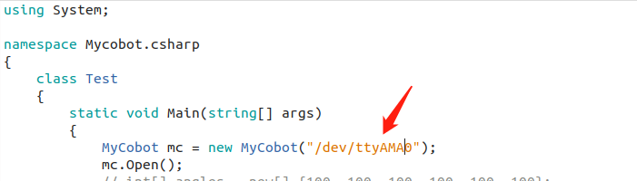
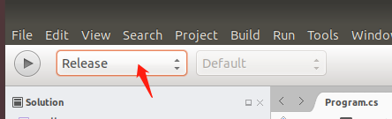
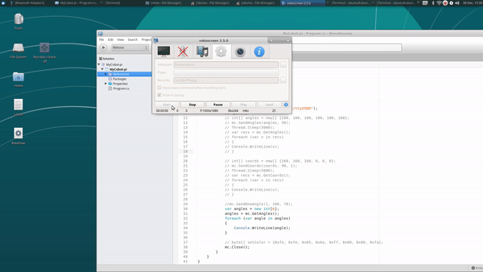
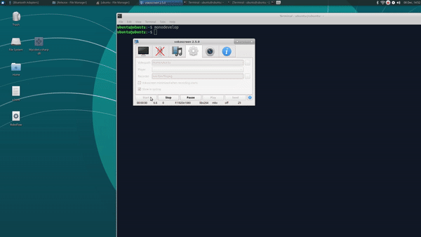
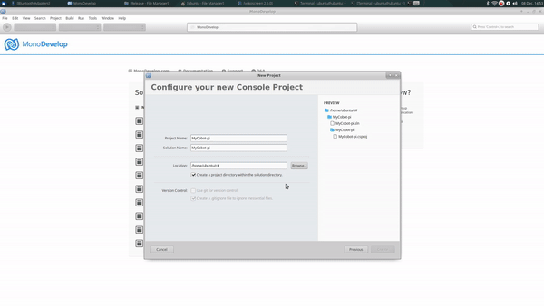
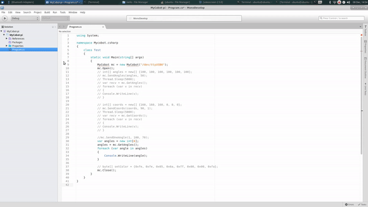
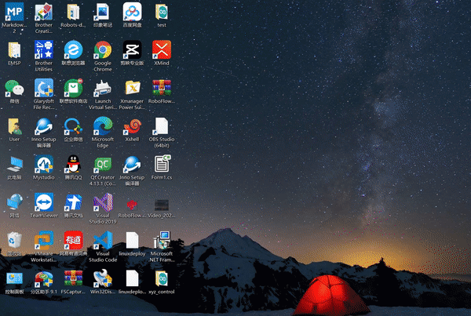
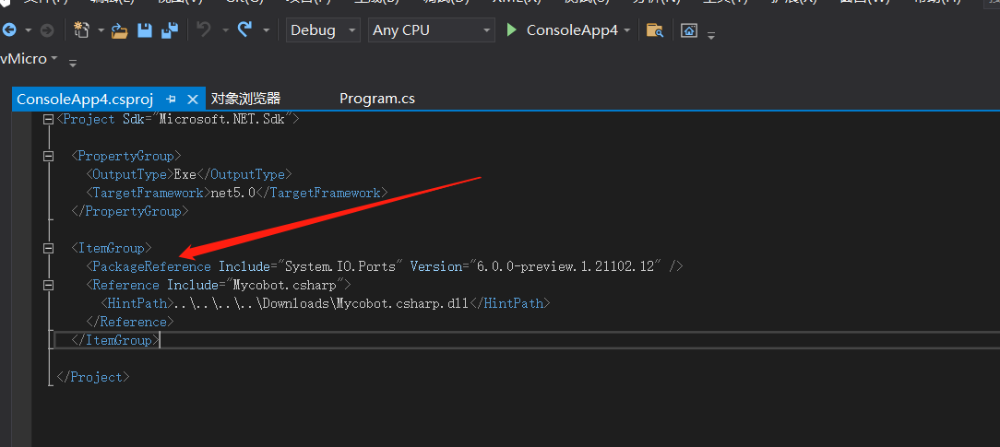
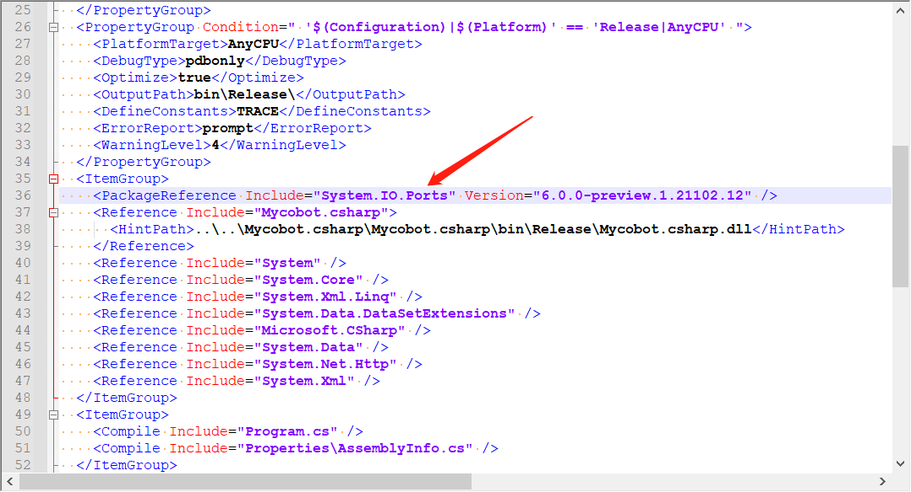

# This is a simple c# api about mycobot

> dotnet version: 5.0.103

##download

You can download the `.dll` at [Release](https://github.com/elephantrobotics/Mycobot.csharp/releases)

#Build on PI<br>
##Environment<br>
The **MonoDevelop** development tool is recommended<br>
How to **install MonoDevelop**:**https://www.monodevelop.com/download/#fndtn-download-lin**<br>
eg:1、Install:<br>
		**sudo apt install apt-transport-https dirmngr**<br>
		**sudo apt-key adv --keyserver hkp://keyserver.ubuntu.com:80 --recv-keys 3FA7E0328081BFF6A14DA29AA6A19B38D3D831EF**<br>
		**echo "deb https://download.mono-project.com/repo/ubuntu vs-bionic main" | sudo tee /etc/apt/sources.list.d/mono-official-vs.list**<br>
		**sudo apt update**<br>
		**sudo apt-get install monodevelop**<br>
	2、Test:<br>
		**Test whether the software is successful**, see the introduction here: **https://www.monodevelop.com/documentation/creating-a-simple-solution/**<br>

##Build&Run<br>
1、Create a **C# console** application;<br>
2、**Copy** the code of the cloned file **program.cs**,then **paste** it into the program.cs of the new project;<br>
3、Change the **serial port** id to **/dev/ttyAMA0**;<br>
<br>
4、Change the compilation mode to **Release**;<br>
<br>
5、Add **Mycobot.csharp.dll** library:ReFerences-->Edit References-->.Net Assembly-->Browse(path for .dll)<br>
<br>
6、Run.<br>
Note:Build&&Run,the whole operation process can be seen in the following GIF:<br>
<br>
<br>
<br>


#Build on Windows

###**notice:**<br>
if you project **target frame** is **.net core**,download **net core/Mycobot.csharp.dll**,if is **.net framework**,download **net framework/Mycobot.csharp.dll**)

###how to check target frame



##use

###import

1、import **Mycobot.csharp.dll** to you Project.<br>
2、add system.io.ports to ***.csproj(*** is your project name,this file is in your project directory),like this:<br>
**frame: .net core**<br>
<br>
**frame: .net framework**<br>



###problem

when use you will have some prolem:<br> 
1、probelm: System.Runtime, Version=5.0.0.0, Culture=neutral, PublicKeyToken=b03f5f7f11d50a3a' or one of its dependencies...<br>
solve:update your sdk(if .net core,update to **5.0** and choose,if .net framework update to **4.0** and choose **4.7.2**),like this:<br>

<br>
2、probelm:System.IO.FileNotFoundException:“Could not load file or assembly 'System.IO.Ports, Version=6.0.0.0, Culture=neutral, PublicKeyToken=cc7b13ffcd2ddd51'. <br>
solve:look use-->2
 

###API
/// arm power on
public void PowerOn()

/// arm power off
public void PowerOff()

/// Send one angle value
public void SendOneAngle(int jointNo, int angle, int speed)

/// Send all angles
public void SendAngles(int[] angles, int speed)

/// Get all angles
public int[] GetAngles()

/// Send one coord
public void SendOneCoord(int coord, int value, int speed)

/// Send all coords to arm
public void SendCoords(int[] coords, int speed, int mode)

/// Get all coord
public int[] GetCoords()
```
